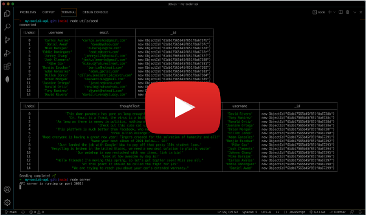
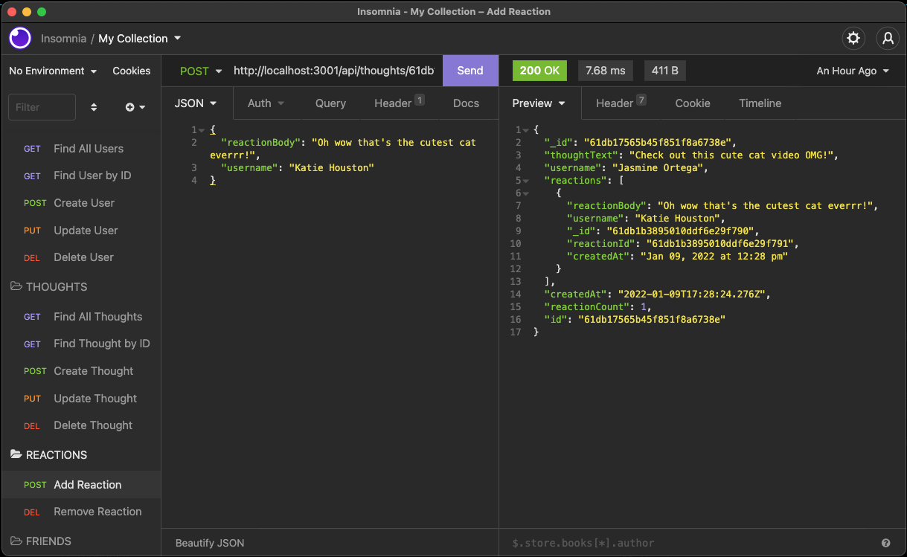

# my-social-api

<br />

## Table of Contents

- [Description](#description)
- [User Story](#user-story)
- [Installation](#installation)
- [Deployment](#deployment)
- [License](#license)
- [Demo](#demo)
- [Criteria](#criteria)
- [Collaboration](#collaboration)

<br />
<br />

## Description

My Social API is a social network web application where users can share their thoughts and ideas, react to friends, and create a friend list.

<br />
<br />

## User Story

```
AS A social media startup
I WANT an API for my social network that uses a NoSQL database
SO THAT my website can handle large amounts of unstructured data
```

<br />
<br />

## Installation

⬇️

Must first initialize with the following commands:

```
npm i
node utils/seed

```

<br />

Application will then run in the command-line with:

```
node server
```

<br />
<br />

## Deployment

[](https://.../)

<br />

**Employing the following technology:**

[](https://www.npmjs.com/package/express) [](https://docs.mongodb.com/) [](https://www.npmjs.com/package/mongoose)  
[](https://www.npmjs.com/package/express) [](https://momentjs.com/)

<br />
<br />

## License

Copyright (c) David Dyer [2022]

[](https://choosealicense.com/licenses/isc/)

<br />
<br />

## Demo

[](https://youtu.be/v54KFOm51Ew)



<br />
<br />

## Criteria

✅

```
After command to invoke app, the server is launched and the Mongoose
models are synced to the MongoDB database.

When opening API GET routes in Insomnia for users and thoughts, then
user is presented with data for these routes in formatted JSON.

When testing API POST, PUT, and DELETE routes in Insomnia, the user
is able to successfully create, update, and delete users and thoughts.

When testing API POST and DELETE routes in Insomnia, the user is able
to successfully create and delete reactions to thoughts

When testing API POST and DELETE routes in Insomnia, the user is able
add and remove friends from a user’s friend list
```

<br />
<br />

## Collaboration

Development efforts included much deliberation with my fellow cohort:  
**Olsen Ogouchi**

<a href= "https://github.com/Chrisolsen1993"></a>

<br />
<br />
<br />
Let's build something!

🛠️
